# 🍔 iFood Clone - Microservices Architecture

Um clone do iFood implementado com arquitetura de microsserviços usando tecnologias modernas e práticas DevOps.

## 🛠️ Tecnologias

- **Java 21** (Eclipse Temurin)
- **Spring Boot 3.2+**
- **Spring Cloud 2023.0.x**
- **Apache Kafka**
- **Docker & Docker Compose**
- **Alpine Linux** (Containers otimizados)
- **Maven Wrapper 3.9.11**
- **Kubernetes**
- **PostgreSQL 15**
- **Redis 7.2**
- **MongoDB 7.0**

## 🏗️ Arquitetura do Sistema

```mermaid
graph TB
    %% Client Layer
    Mobile[📱 Mobile App]
    Web[🌐 Web App]
    
    %% API Gateway Layer
    Gateway[🚪 API Gateway<br/>:8080]
    
    %% Infrastructure Services
    Config[⚙️ Config Server<br/>:8888]
    Discovery[🔍 Service Discovery<br/>:8761]
    
    %% Core Business Services
    Auth[🔐 Auth Service<br/>:8081]
    User[👤 User Service<br/>:8082]
    Restaurant[🏪 Restaurant Service<br/>:8083]
    Menu[📋 Menu Service<br/>:8084]
    Order[🛒 Order Service<br/>:8085]
    Payment[💳 Payment Service<br/>:8086]
    Notification[📢 Notification Service<br/>:8087]
    Delivery[🚚 Delivery Service<br/>:8088]
    Review[⭐ Review Service<br/>:8089]
    
    %% Data Layer
    PostgreSQL[(🐘 PostgreSQL<br/>:5433)]
    MongoDB[(🍃 MongoDB<br/>:27018)]
    Redis[(⚡ Redis<br/>:6380)]
    Kafka[📨 Apache Kafka<br/>:9092]
    
    %% Client connections
    Mobile --> Gateway
    Web --> Gateway
    
    %% Gateway connections
    Gateway --> Auth
    Gateway --> User
    Gateway --> Restaurant
    Gateway --> Menu
    Gateway --> Order
    Gateway --> Payment
    Gateway --> Notification
    Gateway --> Delivery
    Gateway --> Review
    
    %% Service Discovery
    Discovery --> Gateway
    Discovery --> Auth
    Discovery --> User
    Discovery --> Restaurant
    Discovery --> Menu
    Discovery --> Order
    Discovery --> Payment
    Discovery --> Notification
    Discovery --> Delivery
    Discovery --> Review
    
    %% Configuration
    Config --> Gateway
    Config --> Discovery
    Config --> Auth
    Config --> User
    Config --> Restaurant
    Config --> Menu
    Config --> Order
    Config --> Payment
    Config --> Notification
    Config --> Delivery
    Config --> Review
    
    %% PostgreSQL connections
    Auth -.-> PostgreSQL
    User -.-> PostgreSQL
    Restaurant -.-> PostgreSQL
    Menu -.-> PostgreSQL
    Order -.-> PostgreSQL
    Payment -.-> PostgreSQL
    Delivery -.-> PostgreSQL
    
    %% MongoDB connections
    Notification -.-> MongoDB
    Review -.-> MongoDB
    
    %% Redis connections
    Auth -.-> Redis
    Gateway -.-> Redis
    
    %% Kafka connections
    User --> Kafka
    Restaurant --> Kafka
    Menu --> Kafka
    Order --> Kafka
    Payment --> Kafka
    Notification --> Kafka
    Delivery --> Kafka
    Review --> Kafka
    
    %% Styling
    classDef client fill:#e1f5fe
    classDef infrastructure fill:#f3e5f5
    classDef business fill:#e8f5e8
    classDef database fill:#fff3e0
    
    class Mobile,Web client
    class Gateway,Config,Discovery infrastructure
    class Auth,User,Restaurant,Menu,Order,Payment,Notification,Delivery,Review business
    class PostgreSQL,MongoDB,Redis,Kafka database
```



## 📋 Microsserviços

### 🏗️ Serviços de Infraestrutura

1. **Config Server** (8888) - Configuração centralizada
2. **Service Discovery** (8761) - Eureka Server para descoberta de serviços
3. **API Gateway** (8080) - Roteamento, autenticação e rate limiting

### 🔐 Serviços de Negócio

4. **Auth Service** (8081) - Autenticação JWT e autorização
5. **User Service** (8082) - Gerenciamento de usuários e perfis
6. **Restaurant Service** (8083) - Gerenciamento de restaurantes
7. **Menu Service** (8084) - Cardápios, pratos e preços
8. **Order Service** (8085) - Processamento e acompanhamento de pedidos
9. **Payment Service** (8086) - Processamento de pagamentos
10. **Notification Service** (8087) - Notificações push e email
11. **Delivery Service** (8088) - Rastreamento de entregas
12. **Review Service** (8089) - Avaliações e comentários

## 🚀 Como Executar

### 📋 Pré-requisitos

- **Java 21+** (Eclipse Temurin recomendado)
- **Docker & Docker Compose**
- **Git**

> 💡 **Maven não precisa ser instalado!** O projeto usa Maven Wrapper.

### 🐳 Execução com Docker Compose

```bash
# Clone o repositório
git clone https://github.com/mayconaraujosantos/takeoutfood_ecommerce.git
cd ifood_clone

# Construir e executar todos os serviços
docker-compose up -d

# Ver logs de um serviço específico
docker-compose logs -f auth-service

# Parar todos os serviços
docker-compose down
```

### 🏗️ Build dos Microsserviços

```bash
# Build com Maven Wrapper (recomendado)
./mvnw clean package -DskipTests

# Build de imagens Docker otimizadas (Alpine + Java 21)
./build-from-root.sh

# Build individual de um serviço
docker build -f auth-service/Dockerfile.root -t ifood_clone-auth-service .
```

### ☸️ Execução com Kubernetes

```bash
kubectl apply -f k8s/
```

### 🔧 Desenvolvimento Local

```bash
# Executar apenas a infraestrutura (Kafka, PostgreSQL, etc.)
docker-compose -f docker-compose.infrastructure.yml up -d

# Executar um serviço específico
cd auth-service
../mvnw spring-boot:run
```

## 📡 Endpoints dos Serviços

### 🏗️ Infraestrutura

| Serviço | Porta | Endpoint | Descrição |
|---------|-------|----------|-----------|
| **Config Server** | 8888 | <http://localhost:8888> | Configurações centralizadas |
| **Eureka Dashboard** | 8761 | <http://localhost:8761> | Discovery de serviços |
| **API Gateway** | 8080 | <http://localhost:8080> | Gateway principal |

### 🔐 Serviços de Negócio

| Serviço | Porta | Endpoint | Health Check |
|---------|-------|----------|--------------|
| **Auth Service** | 8081 | <http://localhost:8081> | <http://localhost:8081/actuator/health> |
| **User Service** | 8082 | <http://localhost:8082> | <http://localhost:8082/actuator/health> |
| **Restaurant Service** | 8083 | <http://localhost:8083> | <http://localhost:8083/actuator/health> |
| **Menu Service** | 8084 | <http://localhost:8084> | <http://localhost:8084/actuator/health> |
| **Order Service** | 8085 | <http://localhost:8085> | <http://localhost:8085/actuator/health> |
| **Payment Service** | 8086 | <http://localhost:8086> | <http://localhost:8086/actuator/health> |
| **Notification Service** | 8087 | <http://localhost:8087> | <http://localhost:8087/actuator/health> |
| **Delivery Service** | 8088 | <http://localhost:8088> | <http://localhost:8088/actuator/health> |
| **Review Service** | 8089 | <http://localhost:8089> | <http://localhost:8089/actuator/health> |

### 📊 Infraestrutura Externa

| Componente | Porta | Acesso |
|------------|-------|---------|
| **PostgreSQL** | 5433 | `localhost:5433` |
| **MongoDB** | 27018 | `localhost:27018` |
| **Redis** | 6380 | `localhost:6380` |
| **Kafka** | 9092 | `localhost:9092` |
| **Zookeeper** | 2181 | `localhost:2181` |

## ⚙️ Configuração e Arquitetura

### 🔧 Config Server

Todas as configurações estão centralizadas no Config Server:

```
config-server/src/main/resources/config/
├── application.yml          # Configurações globais
├── api-gateway.yml         # Configurações do Gateway
├── auth-service.yml        # Configurações de autenticação
└── service-discovery.yml   # Configurações do Eureka
```

### 🏗️ Padrões Arquiteturais

- **API Gateway Pattern** - Ponto único de entrada
- **Service Discovery** - Descoberta automática de serviços
- **Circuit Breaker** - Resiliência e tolerância a falhas
- **Event-Driven Architecture** - Comunicação via Kafka
- **CQRS** - Separação de comandos e consultas
- **Database per Service** - Isolamento de dados

### 🐳 Containerização

- **Multi-stage Builds** - Imagens otimizadas
- **Alpine Linux** - Base mínima e segura
- **Non-root Users** - Segurança aprimorada
- **Health Checks** - Monitoramento automático

## 📊 Observabilidade e Monitoramento

- **Spring Boot Actuator** - Health checks e métricas
- **Distributed Tracing** - Rastreamento de requisições
- **Structured Logging** - Logs padronizados
- **Prometheus** - Coleta de métricas
- **Grafana** - Dashboards e visualização

## 🗄️ Persistência de Dados

### 📊 PostgreSQL (Porta 5433)
- **User Service** - Perfis e autenticação
- **Restaurant Service** - Dados de restaurantes
- **Menu Service** - Cardápios e produtos
- **Order Service** - Pedidos e histórico
- **Payment Service** - Transações
- **Delivery Service** - Entregas e rotas

### 📄 MongoDB (Porta 27018)
- **Notification Service** - Histórico de notificações
- **Review Service** - Avaliações e comentários

### ⚡ Redis (Porta 6380)
- **Cache** - Sessions e dados frequentes
- **Rate Limiting** - Controle de requisições
- **JWT Blacklist** - Tokens inválidos

### 📨 Apache Kafka (Porta 9092)
- **Event Streaming** - Comunicação assíncrona
- **Order Events** - Processamento de pedidos
- **User Events** - Eventos de usuário
- **Notification Events** - Disparo de notificações

## 🛠️ Scripts Utilitários

```bash
# Build automatizado de todas as imagens
./build-from-root.sh

# Atualizar Dockerfiles
./update-dockerfiles.sh

# Criar Dockerfiles otimizados
./create-root-dockerfiles.sh

# Deploy completo
./deploy.sh
```

## 🔒 Segurança

- **JWT Authentication** - Tokens seguros
- **Spring Security** - Proteção de endpoints
- **HTTPS/TLS** - Comunicação criptografada
- **Input Validation** - Validação de dados
- **SQL Injection Protection** - Proteção contra ataques
- **Rate Limiting** - Proteção contra DDoS

## 📱 Funcionalidades Implementadas

### 👤 Gestão de Usuários
- Cadastro e autenticação
- Perfis de usuário (Cliente/Restaurante/Entregador)
- Histórico de pedidos

### 🏪 Gestão de Restaurantes
- Cadastro de restaurantes
- Gerenciamento de cardápios
- Horários de funcionamento

### 🛒 Processamento de Pedidos
- Carrinho de compras
- Processamento de pagamentos
- Acompanhamento em tempo real

### 🚚 Sistema de Entregas
- Atribuição automática de entregadores
- Rastreamento GPS
- Estimativa de tempo

### 📢 Sistema de Notificações
- Push notifications
- Notificações por email
- Alertas em tempo real

### ⭐ Sistema de Avaliações
- Avaliações de restaurantes
- Avaliações de pratos
- Sistema de comentários

## 🚀 Próximos Passos

- [ ] **Implementação de WebSockets** para atualizações em tempo real
- [ ] **Sistema de Cupons** e promoções
- [ ] **Analytics Dashboard** para restaurantes
- [ ] **Machine Learning** para recomendações
- [ ] **Mobile App** React Native
- [ ] **Kubernetes Deployment** completo
- [ ] **CI/CD Pipeline** com GitHub Actions

---

## 📞 Contato

**Desenvolvedor:** Maycon Araújo Santos  
**Email:** maycon.araujo.santos@example.com  
**GitHub:** [@mayconaraujosantos](https://github.com/mayconaraujosantos)

---

⭐ **Se este projeto foi útil, por favor dê uma estrela!** ⭐
