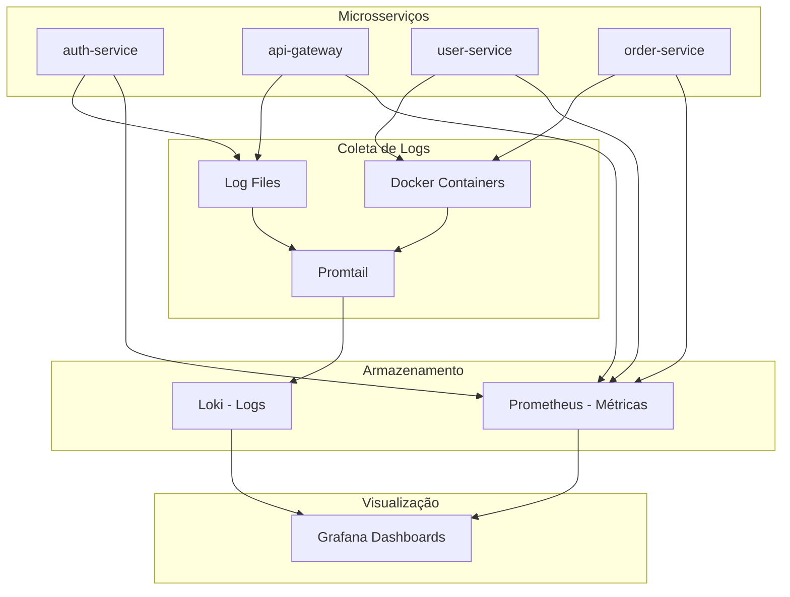

# Guia de Observabilidade - iFood Clone

## 🎯 Visão Geral

Este guia explica como usar a stack de observabilidade configurada para o projeto iFood Clone, incluindo **Promtail** para coleta de logs, **Loki** para armazenamento, **Prometheus** para métricas, e **Grafana** para visualização.

## 🏗️ Arquitetura de Observabilidade



## 🚀 Iniciando a Stack

### 1. Iniciar Stack de Observabilidade

```bash
# Executar script de inicialização
./scripts/start-observability.sh

# Ou manualmente:
docker-compose -f docker-compose.observability.yml up -d
```

### 2. Iniciar Microsserviços

```bash
# Microsserviços com logging configurado
docker-compose up -d
```

## 📊 Configuração do Promtail

O **Promtail** está configurado para coletar logs de múltiplas fontes:

### 📁 Coleta de Arquivos de Log

```yaml
# Logs estruturados JSON dos microsserviços
- job_name: ifood-microservices-files
  static_configs:
    - targets: [localhost]
      labels:
        job: ifood-microservices
        env: local
        __path__: /var/log/ifood/**/*.log
```

### 🐳 Coleta de Containers Docker

```yaml
# Logs dos containers com label específico
- job_name: docker-containers
  docker_sd_configs:
    - host: unix:///var/run/docker.sock
      refresh_interval: 5s
      filters:
        - name: label
          values: ["logging=promtail"]
```

### 🔒 Logs Específicos do Auth Service

```yaml
# Logs de autenticação e segurança
- job_name: auth-service-logs
  static_configs:
    - targets: [localhost]
      labels:
        job: auth-service
        service: auth-service
        auth_related: "true"
```

## 📋 Labels e Parsing de Logs

O Promtail adiciona automaticamente as seguintes labels:

| Label | Descrição | Exemplo |
|-------|-----------|---------|
| `service` | Nome do microsserviço | `auth-service` |
| `env` | Ambiente de execução | `local`, `docker`, `prod` |
| `level` | Nível do log | `INFO`, `ERROR`, `DEBUG` |
| `job` | Job de coleta | `ifood-microservices` |
| `thread` | Thread da aplicação | `http-nio-8081-exec-1` |
| `logger` | Classe que gerou o log | `c.i.auth.service.AuthService` |

### Parsing de Logs Spring Boot

O Promtail usa regex para extrair informações dos logs:

```regex
^(?P<timestamp>\d{4}-\d{2}-\d{2}\s\d{2}:\d{2}:\d{2}\.\d{3})\s+
(?P<level>\w+)\s+(?P<pid>\d+)\s+---\s+
\[\s*(?P<thread>[^\]]+)\]\s+(?P<logger>[^\s]+)\s*:\s*(?P<message>.*)$
```

## 📊 Dashboards Disponíveis

### 1. **Microservices Overview**
- ✅ Status de saúde dos serviços
- 📈 Taxa de requisições HTTP  
- ⏱️ Tempos de resposta (percentil 95)
- 💾 Uso de memória JVM
- 🔌 Pool de conexões de banco

### 2. **Logs Dashboard**
- 📊 Volume de logs por serviço
- 🎯 Distribuição por nível de log
- ⚠️ Timeline de erros
- 🔒 Logs de autenticação
- 🌐 Logs do API Gateway

## 🔍 Consultas Úteis no Grafana

### Buscar Erros por Serviço

```logql
{job="ifood-microservices", level="ERROR"} 
| json 
| line_format "{{.timestamp}} [{{.service}}] {{.message}}"
```

### Logs de Autenticação

```logql
{job="auth-service"} 
|~ "(?i)(jwt|token|auth|login|user)"
| json
| line_format "{{.timestamp}} [{{.level}}] {{.message}}"
```

### Requisições HTTP no Gateway

```logql
{job="api-gateway"} 
|~ "(GET|POST|PUT|DELETE)"
| json 
| line_format "{{.method}} {{.path}} - {{.status}}"
```

### Filtrar por Período de Tempo

```logql
{job="ifood-microservices"} 
| json 
| __error__ = ""
| timestamp >= now() - 1h
```

## 🔧 Configuração de Logging Estruturado

### Logback Configuration (JSON)

Os microsserviços estão configurados para gerar logs em formato JSON:

```xml
<!-- logback-spring.xml -->
<appender name="JSON_FILE" class="ch.qos.logback.core.rolling.RollingFileAppender">
    <file>/app/logs/auth-service.json</file>
    <encoder class="net.logstash.logback.encoder.LoggingEventCompositeJsonEncoder">
        <providers>
            <timestamp/>
            <logLevel/>
            <message/>
            <mdc/>
            <pattern>
                <pattern>
                    {
                        "service": "auth-service",
                        "environment": "${SPRING_PROFILES_ACTIVE:-local}",
                        "thread": "%thread",
                        "logger": "%logger{36}"
                    }
                </pattern>
            </pattern>
        </providers>
    </encoder>
</appender>
```

### Dependências Maven

```xml
<!-- Logging estruturado -->
<dependency>
    <groupId>net.logstash.logback</groupId>
    <artifactId>logstash-logback-encoder</artifactId>
    <version>7.4</version>
</dependency>

<!-- Integração direta com Loki -->
<dependency>
    <groupId>com.github.loki4j</groupId>
    <artifactId>loki-logback-appender</artifactId>
    <version>1.4.2</version>
</dependency>
```

## 🎯 Métricas Prometheus

### Métricas Spring Boot Actuator

Todos os microsserviços expõem métricas via `/actuator/prometheus`:

- `http_server_requests_seconds_count` - Contador de requisições
- `http_server_requests_seconds_sum` - Tempo total de requisições  
- `jvm_memory_used_bytes` - Uso de memória JVM
- `hikaricp_connections_active` - Conexões ativas do banco
- `system_cpu_usage` - Uso de CPU do sistema

### Consultas Prometheus Úteis

```promql
# Taxa de requisições por minuto
rate(http_server_requests_seconds_count[1m])

# Percentil 95 de latência
histogram_quantile(0.95, rate(http_server_requests_seconds_bucket[5m]))

# Uso de memória heap
jvm_memory_used_bytes{area="heap"} / jvm_memory_max_bytes{area="heap"} * 100
```

## 🚨 Alertas e Monitoramento

### Logs de Erro Críticos

Configure alertas para:
- ❌ Logs de nível ERROR em produção
- 🔒 Falhas de autenticação frequentes
- 🌐 Erros 5xx no API Gateway
- 💾 Erros de conexão com banco de dados

### Métricas de Performance  

Monitor:
- 📈 Taxa de requisições > threshold
- ⏱️ Latência > 2 segundos (P95)
- 💾 Uso de memória > 80%
- 🔌 Pool de conexões esgotado

## 📱 URLs de Acesso

| Serviço | URL | Credenciais |
|---------|-----|-------------|
| **Grafana** | http://localhost:3000 | admin / ifood_grafana_pass |
| **Prometheus** | http://localhost:9090 | - |
| **Loki** | http://localhost:3100 | - |
| **Jaeger** | http://localhost:16686 | - |

## 🛠️ Troubleshooting

### Promtail não está coletando logs

1. Verificar se os containers têm label `logging=promtail`
2. Confirmar que o diretório `/var/log/ifood` existe
3. Verificar permissões de leitura dos arquivos de log

### Logs não aparecem no Grafana

1. Verificar conectividade Promtail → Loki
2. Validar configuração de datasource no Grafana
3. Conferir filtros de tempo na consulta

### Performance do Promtail

1. Ajustar `readline_rate` e `readline_burst` no config
2. Usar appenders assíncronos no Logback
3. Configurar rotação de logs adequada

## 📚 Recursos Adicionais

- [Documentação Oficial do Promtail](https://grafana.com/docs/loki/latest/clients/promtail/)
- [LogQL Query Language](https://grafana.com/docs/loki/latest/logql/)
- [Spring Boot Logging](https://docs.spring.io/spring-boot/docs/current/reference/html/features.html#features.logging)